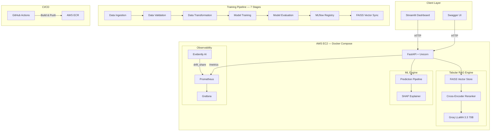

<div align="center">

# 🏪 Retail Intelligence — End-to-End Sales Forecasting Pipeline

**Production MLOps system combining predictive ML with Tabular RAG for contextual business intelligence**

[](https://python.org)
[](https://fastapi.tiangolo.com)
[](https://docker.com)
[](https://aws.amazon.com)
[](https://prometheus.io)
[](https://grafana.com)
[](https://github.com/features/actions)
[](LICENSE)

[Architecture](#-system-architecture) · [Features](#-key-features) · [Quick Start](#-quick-start) · [API Reference](#-api-reference) · [Monitoring](#-observability-stack)

</div>

---

## Overview

Most retail forecasting projects stop at a Jupyter Notebook. This one doesn't.

This is a **7-stage automated ML pipeline** that ingests retail transaction data, engineers temporal features, trains and evaluates models, registers them in MLflow, syncs a FAISS vector database, and serves predictions through a secured FastAPI endpoint — all orchestrated through a single `TrainPipeline.run()` call.

What makes it different is the **Tabular RAG layer**: instead of just returning a number, the system retrieves semantically similar store profiles from a FAISS index, re-ranks them with a Cross-Encoder, and generates natural-language business explanations via LLM. A store manager doesn't get *"predicted sales: ₹15,420"* — they get *"sales are expected to be strong due to the ongoing promotion and this store's historically high foot traffic on Wednesdays."*

The system is fully containerized, deployed on AWS EC2 with a 3-container Docker Compose stack (API + Prometheus + Grafana), and automated via GitHub Actions CI/CD.

---

## 🏗️ System Architecture



---

## ✨ Key Features

### Intelligent Forecasting
- **7-Stage Automated Pipeline** — Data Ingestion → Validation → Transformation → Training → Evaluation → MLflow Registry → FAISS Sync
- **Recursive Multi-Step Forecasting** — Generates 1–30 day rolling forecasts where each prediction feeds into the next step's lag features
- **SHAP Explainability** — Every prediction comes with the top-5 feature attributions via `TreeExplainer`

### Tabular RAG (Retrieval-Augmented Generation)
- **FAISS Semantic Search** — Store profiles from `store.csv` are converted into narrative text chunks and indexed for similarity search
- **Cross-Encoder Re-Ranking** — Retrieved candidates are re-ranked using `ms-marco-MiniLM-L-6-v2` for precision
- **LLM Business Analysis** — Groq-hosted `LLaMA 3.3 70B` generates contextual explanations grounded in retrieved store data

### Production Observability (4-Layer Prometheus Metrics)
| Layer | Metrics | Source |
|-------|---------|--------|
| **L1 — HTTP** | `http_requests_total`, `http_request_duration_seconds` | `prometheus-fastapi-instrumentator` |
| **L2 — Model** | `model_prediction_value`, `model_inference_latency_seconds`, `model_total_predictions` | Custom Gauges |
| **L3 — Drift** | `drift_share`, `drift_drifted_columns_count`, `drift_retraining_required` | Evidently AI |
| **L4 — RAG** | `rag_inference_latency_seconds`, `rag_success_total`, `rag_failure_total` | Custom Gauges |

### Deployment & Automation
- **Dockerized Stack** — `docker-compose.yml` orchestrates API, Prometheus, and Grafana with health checks and auto-restart
- **GitHub Actions CI/CD** — 3-stage pipeline: Test → Build & Push to ECR → Deploy to AWS
- **Terraform IaC** — Reproducible EC2 provisioning with security groups and storage configuration
- **API Key Authentication** — Secured endpoints via `X-API-KEY` header validation

---

## 💻 Technology Stack

| Layer | Technologies |
|-------|-------------|
| **ML / Training** | LightGBM · Scikit-Learn · PyTorch · Pandas · SHAP |
| **GenAI / RAG** | FAISS · SentenceTransformers · CrossEncoder · Groq (LLaMA 3.3) · LangChain |
| **API** | FastAPI · Uvicorn · Pydantic v2 |
| **Observability** | Prometheus · Grafana · Evidently AI · MLflow |
| **Infrastructure** | Docker · Docker Compose · AWS EC2 · Terraform |
| **CI/CD** | GitHub Actions · AWS ECR |
| **Frontend** | Streamlit |

---

## 🚀 Quick Start

### Option 1: Docker Compose (Recommended)

```bash
# Clone
git clone https://github.com/shivam-nayak-ds/Retail-Ops-End-to-End-Sales-Forecasting-Pipeline.git
cd Retail-Ops-End-to-End-Sales-Forecasting-Pipeline

# Configure
cp .env.example .env
# Edit .env → add your GOOGLE_API_KEY and GROQ_API_KEY

# Launch entire stack
docker compose up -d --build

# Verify
docker compose ps
```

Services will be available at:
| Service | URL |
|---------|-----|
| FastAPI Swagger | `http://localhost:8000/docs` |
| Prometheus | `http://localhost:9090` |
| Grafana | `http://localhost:3000` (admin/admin) |

### Option 2: Local Development

```bash
python -m venv venv && source venv/bin/activate   # Windows: venv\Scripts\activate
pip install -r requirements.txt && pip install -e .

# Train the model
python -c "from Retail_Ops_Pipeline.pipeline.training_pipeline import TrainPipeline; TrainPipeline().run()"

# Start API
uvicorn app_fastapi:app --host 0.0.0.0 --port 8000 --reload

# Start UI (separate terminal)
streamlit run app_streamlit.py
```

---

## 📡 API Reference

### `POST /forecast` — Single-Day Prediction + RAG Analysis
```bash
curl -X POST http://localhost:8000/forecast \
  -H "X-API-KEY: retail-ops-elite-key-2024" \
  -H "Content-Type: application/json" \
  -d '{
    "store": 1, "DayOfWeek": 4, "Date": "2026-05-09",
    "open": 1, "Promo": 1, "StateHoliday": "0",
    "SchoolHoliday": 0, "StoreType": "a", "Assortment": "a",
    "CompetitionDistance": 1270.0
  }'
```

**Response includes:** `prediction`, `analysis` (RAG-generated business explanation), `explanation` (SHAP top-5 features), `latency`

### `POST /forecast/range` — Recursive Multi-Step Forecast
Generates rolling forecasts for 1–30 days. Each prediction updates lag features for the next step.

### `GET /monitor/drift` — Real-Time Drift Detection
Compares training baseline against live prediction logs using Evidently AI. Returns `drift_share`, `drifted_columns_count`, and `requires_retraining` flag.

### `GET /metrics` — Prometheus Metrics Endpoint
Exposes all 4 metric layers for Prometheus scraping at 5-second intervals.

---

## 📊 Observability Stack

Pre-configured Grafana dashboards visualize:
- **API Health** — Request throughput, latency percentiles, error rates
- **Model Performance** — Prediction distributions, inference latency per store
- **Data Drift** — Drift share trends, drifted column counts, retraining flags
- **RAG Performance** — LLM call latency, success/failure ratios

Prometheus scrapes the `/metrics` endpoint every 5 seconds. Grafana dashboards are auto-provisioned via `grafana/provisioning/`.

---

## 📂 Project Structure

```
├── app_fastapi.py              # Production API server (429 lines)
├── app_streamlit.py            # Interactive frontend
├── docker-compose.yml          # 3-service orchestration
├── Dockerfile                  # Multi-stage Python build
├── prometheus.yml              # Scrape configuration
├── Makefile                    # Developer commands (make train, make test, etc.)
├── .github/workflows/main.yaml # 3-stage CI/CD pipeline
├── terraform/main.tf           # AWS EC2 IaC provisioning
│
├── src/Retail_Ops_Pipeline/
│   ├── components/             # 7 modular pipeline stages
│   │   ├── data_ingestion.py
│   │   ├── data_validation.py
│   │   ├── data_transformation.py
│   │   ├── model_trainer.py
│   │   ├── model_evaluation.py
│   │   ├── model_registry.py
│   │   └── model_monitoring.py # Evidently AI drift detection
│   ├── genai/
│   │   ├── embeddings.py       # Tabular-to-text + FAISS indexing
│   │   ├── rag_pipeline.py     # FAISS → CrossEncoder → LLM chain
│   │   └── prompt_templates.py
│   ├── pipeline/
│   │   ├── training_pipeline.py    # 7-stage orchestrator
│   │   └── prediction_pipeline.py  # Inference engine
│   ├── config/                 # YAML-driven configuration
│   ├── entity/                 # Dataclass schemas
│   └── utils/
│       ├── logger.py           # Structured logging
│       └── exception.py        # Custom exception handling
│
├── grafana/
│   ├── dashboards/             # Pre-built JSON dashboards
│   └── provisioning/           # Auto-provisioned datasources
├── scripts/
│   └── simulate_customers.py   # Production traffic simulator with synthetic drift
└── tests/
    ├── test_api.py
    └── test_pipeline.py
```

---

## 🔧 Development

```bash
make install-dev    # Install with dev dependencies
make train          # Run full training pipeline
make test           # Run test suite
make lint           # Lint with ruff
make docker-build   # Build Docker image
make docker-run     # Launch full stack
make drift-check    # Run drift detection
```

---

## 👤 Author

**Shivam Nayak** — [GitHub](https://github.com/shivam-nayak-ds)

---

<div align="center">
<sub>Built from scratch. No templates. No shortcuts. Just engineering.</sub>
</div>
