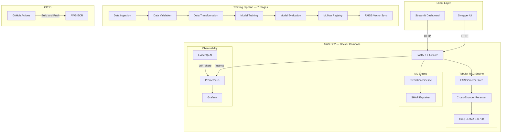
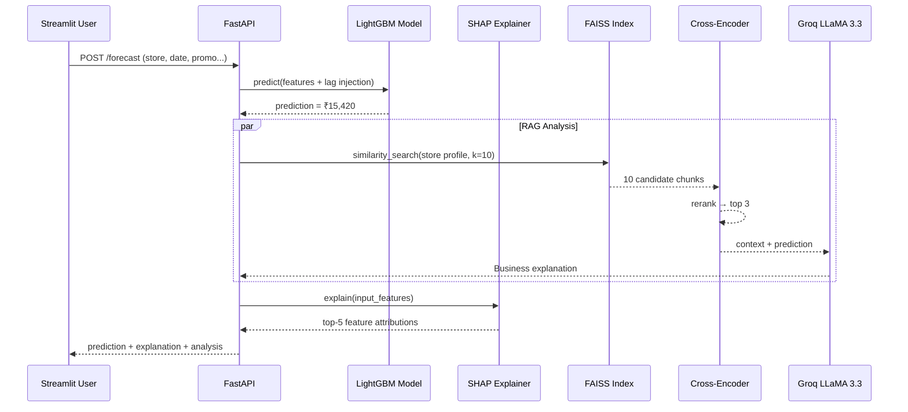

<div align="center">

# 🏪 Retail Intelligence — End-to-End Sales Forecasting Pipeline

**Production-grade Retail Intelligence Platform that combines Sales Forecasting, RAG-based Business Explanations, Automated Drift Detection, Real-time Monitoring, CI/CD, and Cloud Deployment.**

Built using FastAPI, LightGBM, FAISS, Groq LLaMA, Docker, AWS EC2, Prometheus/Grafana, and GitHub Actions.

[](https://python.org)
[](https://fastapi.tiangolo.com)
[](https://docker.com)
[](https://aws.amazon.com)
[](https://prometheus.io)
[](https://grafana.com)
[](https://github.com/features/actions)
[](LICENSE)

[Live Demo](#-live-demo) · [Architecture](#-system-architecture) · [Features](#-key-features) · [Results](#-model-performance) · [Quick Start](#-quick-start) · [API Reference](#-api-reference)

</div>

---

## 🌐 Live Demo

The system is deployed on **AWS EC2 (Mumbai Region)** via Docker Compose.

| Service | URL | Description |
|---------|-----|-------------|
| **FastAPI Docs** | [`http://13.200.254.145:8000/docs`](http://13.200.254.145:8000/docs) | Interactive Swagger UI — test all endpoints live |
| **Grafana Dashboard** | [`http://13.200.254.145:3000`](http://13.200.254.145:3000) | Real-time monitoring (Login: `admin` / `admin`) |
| **Streamlit UI** | [`http://13.200.254.145:8501`](http://13.200.254.145:8501) | Interactive Frontend Dashboard for Sales Forecasting |

> *IPs are ephemeral. If links are down, the system can be redeployed in under 5 minutes using the included Terraform + Docker Compose configuration.*

---

## 💼 Business Impact

This system helps retail operations teams make **data-driven decisions** instead of relying on gut instinct:

| Use Case | How This System Helps |
|----------|----------------------|
| **Inventory Planning** | 1–30 day store-level forecasts prevent overstocking and stockouts |
| **Promotion Optimization** | RAG analysis explains how promotions impact specific store profiles |
| **Staffing Allocation** | Day-of-week demand patterns enable smarter shift scheduling |
| **Revenue Forecasting** | Multi-step recursive forecasting provides weekly/monthly revenue estimates |
| **Proactive Maintenance** | Automated drift detection alerts teams before model accuracy degrades |

Unlike traditional forecasting systems that only output a number, this platform provides **natural-language business explanations** grounded in historical store context — making insights accessible to non-technical stakeholders.

---

## 🏗️ System Architecture



### Request Flow



---

## ✨ Key Features

### 🧠 Intelligent Forecasting
- **7-Stage Automated Pipeline** — Data Ingestion → Validation → Transformation → Training (GridSearchCV across RandomForest, XGBoost, LightGBM) → Evaluation → MLflow Registry → FAISS Sync
- **Recursive Multi-Step Forecasting** — Generates 1–30 day rolling forecasts where each prediction updates lag features for the next step
- **SHAP Explainability** — Every prediction returns top-5 feature attributions via `TreeExplainer`
- **Automated Feature Engineering** — Temporal features (lag-1, lag-7, lag-30, rolling mean) injected from a pre-computed Feature Store

### 🔍 Tabular RAG (Retrieval-Augmented Generation)
- **FAISS Semantic Search** — Store profiles from `store.csv` converted into narrative text chunks and indexed
- **Cross-Encoder Re-Ranking** — Retrieved candidates re-ranked using `ms-marco-MiniLM-L-6-v2` for precision
- **LLM Business Analysis** — Groq-hosted `LLaMA 3.3 70B` generates contextual explanations grounded in retrieved store data

### 📊 Production Observability (4-Layer Prometheus Metrics)
| Layer | Metrics | Source |
|-------|---------|--------|
| **L1 — HTTP** | `http_requests_total`, `http_request_duration_seconds` | `prometheus-fastapi-instrumentator` |
| **L2 — Model** | `model_prediction_value`, `model_inference_latency_seconds`, `model_total_predictions` | Custom Gauges |
| **L3 — Drift** | `drift_share`, `drift_drifted_columns_count`, `drift_retraining_required` | Evidently AI |
| **L4 — RAG** | `rag_inference_latency_seconds`, `rag_success_total`, `rag_failure_total` | Custom Gauges |

### 🚀 Deployment & Automation
- **Dockerized 3-Container Stack** — API + Prometheus + Grafana with health checks, auto-restart, and shared networking
- **GitHub Actions CI/CD** — 3-stage pipeline: Unit Tests → Docker Build & Push to ECR → Deploy to AWS
- **Terraform IaC** — Reproducible EC2 provisioning with security groups and storage configuration
- **API Key Authentication** — Secured endpoints via `X-API-KEY` header validation

---

## 📈 Model Performance

Metrics from the production model (LightGBM with GridSearchCV hyperparameter tuning):

| Metric | Value | What It Means |
|--------|-------|---------------|
| **RMSE** | `0.2047` | Average prediction error (log-scaled) |
| **MAE** | `0.1275` | Median deviation from actual sales |
| **R² Score** | `0.9962` | Model explains 99.6% of sales variance |

> Metrics computed on held-out test set. Logged and versioned in MLflow.

### Scale & Performance
- Prometheus scrapes `/metrics` every **5 seconds** for real-time observability
- 7-stage pipeline executes end-to-end with a single `TrainPipeline().run()` call
- Supports **30-day recursive forecasting** with dynamic lag feature injection
- API secured with key-based authentication and Pydantic v2 input validation

---

## 🧩 Engineering Challenges Solved

### Recursive Forecast Drift
Multi-step forecasting suffers from error accumulation — each prediction's error compounds into the next step's lag features. Solved by maintaining a rolling Feature Store that injects real historical lags for Step 1, then dynamically updates `sales_lag_1` with each prediction for subsequent steps.

### RAG on Tabular Data (Not Documents)
Standard RAG pipelines work on text documents. Retail data lives in CSV tables. Solved by converting each row of `store.csv` into a natural-language narrative ("Store 1 is a type-a store with basic assortment, located 1270m from the nearest competitor..."), then indexing these stories in FAISS for semantic retrieval.

### Cross-Encoder Re-Ranking Precision
FAISS approximate nearest-neighbor search returns fast but imprecise results. Added a second-stage `ms-marco-MiniLM-L-6-v2` Cross-Encoder that re-scores all 10 candidates and returns only the top 3 — significantly improving context quality for the LLM.

### Production Monitoring Without Overhead
Instead of running a separate monitoring service, all 4 metric layers (HTTP, Model, Drift, RAG) are exposed through the same FastAPI `/metrics` endpoint. Prometheus scrapes this single endpoint, and pre-provisioned Grafana dashboards auto-load via `grafana/provisioning/`.

### Free-Tier Cloud Deployment
Deployed on a `t3.micro` instance (1 vCPU, 1GB RAM) by adding a 4GB swap file to prevent OOM kills during Docker image builds. PyTorch + LightGBM + FAISS all run within this constrained environment.

---

## 💻 Technology Stack

| Layer | Technologies |
|-------|-------------|
| **ML / Training** | LightGBM · XGBoost · RandomForest · Scikit-Learn · SHAP · Pandas |
| **GenAI / RAG** | FAISS · SentenceTransformers · CrossEncoder · Groq LLaMA 3.3 70B · LangChain |
| **API** | FastAPI · Uvicorn · Pydantic v2 |
| **Observability** | Prometheus · Grafana · Evidently AI · MLflow |
| **Infrastructure** | Docker · Docker Compose · AWS EC2 · Terraform |
| **CI/CD** | GitHub Actions · AWS ECR |
| **Frontend** | Streamlit |

---

## 🚀 Quick Start

### Option 1: Docker Compose (Recommended)

```bash
# Clone
git clone https://github.com/shivam-nayak-ds/Retail-Ops-End-to-End-Sales-Forecasting-Pipeline.git
cd Retail-Ops-End-to-End-Sales-Forecasting-Pipeline

# Configure
cp .env.example .env
# Edit .env → add your GOOGLE_API_KEY and GROQ_API_KEY

# Launch entire stack
docker compose up -d --build

# Verify
docker compose ps
```

Services will be available at:
| Service | URL |
|---------|-----|
| FastAPI Swagger | `http://localhost:8000/docs` |
| Prometheus | `http://localhost:9090` |
| Grafana | `http://localhost:3000` (admin/admin) |

### Option 2: Local Development

```bash
python -m venv venv && source venv/bin/activate   # Windows: venv\Scripts\activate
pip install -r requirements.txt && pip install -e .

# Train the model
python -c "from Retail_Ops_Pipeline.pipeline.training_pipeline import TrainPipeline; TrainPipeline().run()"

# Start API
uvicorn app_fastapi:app --host 0.0.0.0 --port 8000 --reload

# Start UI (separate terminal)
streamlit run app_streamlit.py
```

---

## 📡 API Reference

### `POST /forecast` — Single-Day Prediction + RAG Analysis
```bash
curl -X POST http://localhost:8000/forecast \
  -H "X-API-KEY: retail-ops-elite-key-2024" \
  -H "Content-Type: application/json" \
  -d '{
    "store": 1, "DayOfWeek": 4, "Date": "2026-05-09",
    "open": 1, "Promo": 1, "StateHoliday": "0",
    "SchoolHoliday": 0, "StoreType": "a", "Assortment": "a",
    "CompetitionDistance": 1270.0
  }'
```

**Response:** `prediction` + `analysis` (RAG business explanation) + `explanation` (SHAP top-5) + `latency`

### `POST /forecast/range` — Recursive Multi-Step Forecast (1–30 days)
Each day's prediction feeds into the next step's lag features for realistic multi-day projections.

### `GET /monitor/drift` — Real-Time Drift Detection
Compares training baseline against live prediction logs using Evidently AI. Returns `drift_share`, `drifted_columns_count`, and `requires_retraining` flag.

### `GET /metrics` — Prometheus Metrics Endpoint
Exposes all 4 metric layers for Prometheus scraping at 5-second intervals.

---

## 📂 Project Structure

```
├── app_fastapi.py                  # Production API (429 lines, 4 endpoints)
├── app_streamlit.py                # Interactive dashboard
├── docker-compose.yml              # 3-service orchestration
├── Dockerfile                      # Production container build
├── prometheus.yml                  # 5s scrape configuration
├── Makefile                        # Developer commands
├── .github/workflows/main.yaml     # 3-stage CI/CD pipeline
├── terraform/main.tf               # AWS EC2 IaC
│
├── src/Retail_Ops_Pipeline/
│   ├── components/                 # 7 modular pipeline stages
│   │   ├── data_ingestion.py
│   │   ├── data_validation.py
│   │   ├── data_transformation.py
│   │   ├── model_trainer.py        # GridSearchCV across 3 algorithms
│   │   ├── model_evaluation.py     # RMSE, MAE, R² → MLflow
│   │   ├── model_registry.py
│   │   └── model_monitoring.py     # Evidently AI drift detection
│   ├── genai/
│   │   ├── embeddings.py           # Tabular-to-text + FAISS indexing
│   │   ├── rag_pipeline.py         # FAISS → CrossEncoder → LLM chain
│   │   └── prompt_templates.py
│   ├── pipeline/
│   │   ├── training_pipeline.py    # 7-stage orchestrator
│   │   └── prediction_pipeline.py  # Inference engine
│   ├── config/                     # YAML-driven configuration
│   ├── entity/                     # Dataclass schemas
│   └── utils/
│       ├── logger.py               # Structured logging
│       └── exception.py            # Custom exception handling
│
├── grafana/
│   ├── dashboards/                 # Pre-built JSON dashboards
│   └── provisioning/               # Auto-provisioned datasources
├── scripts/
│   └── simulate_customers.py       # Traffic simulator with synthetic drift
└── tests/
    ├── test_api.py
    └── test_pipeline.py
```

---

## 🔧 Development

```bash
make install-dev    # Install with dev dependencies
make train          # Run full training pipeline
make test           # Run test suite
make lint           # Lint with ruff
make docker-build   # Build Docker image
make docker-run     # Launch full stack
make drift-check    # Run drift detection
```

---

## 👤 Author

**Shivam Nayak** — [GitHub](https://github.com/shivam-nayak-ds)

<div align="center">
<sub>Designed and implemented end-to-end by Shivam Nayak.</sub>
</div>
